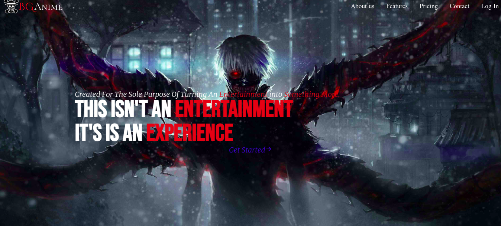
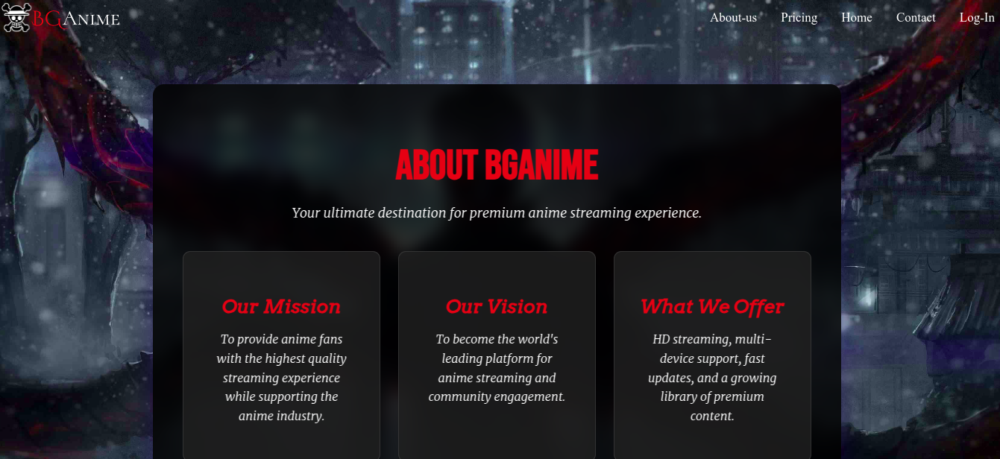
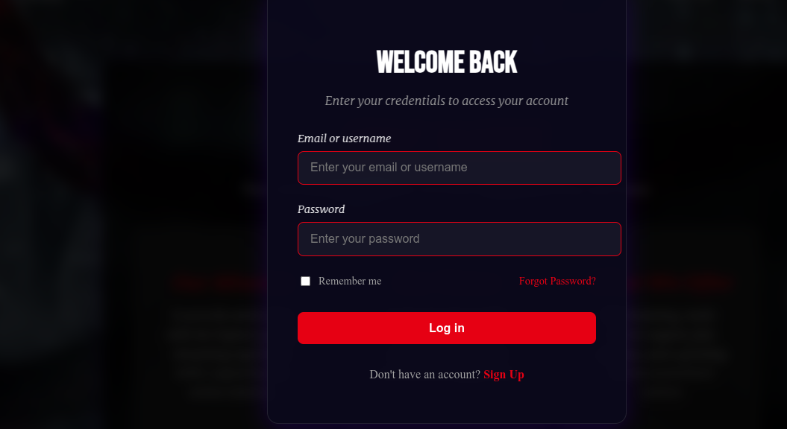
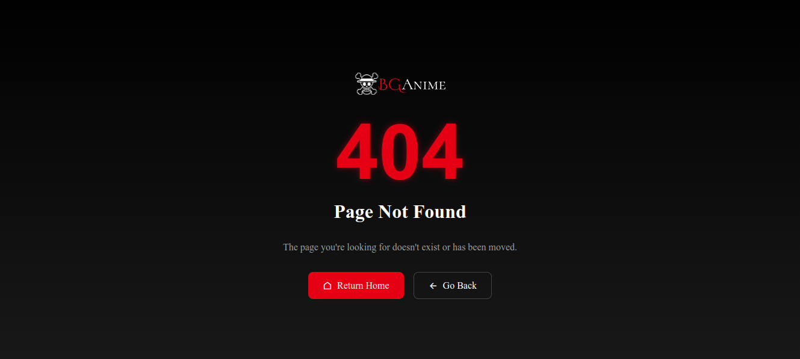

# BGAnime


BGAnime is a modern anime streaming service template showcasing responsive design and interactive user interfaces. Built with a focus on user experience, performance, and accessibility.
## 📋 Table of Contents
- [Features](#-features)
- [Pages](#-pages)
- [Screenshots](#-screenshots)
- [Technologies](#-technologies)
- [Project Structure](#-project-structure)
- [Quick Start](#-quick-start)
- [Development](#-development)
- [Browser Support](#-browser-support)
- [Security](#-security)
- [Progressive Web App](#-progressive-web-app)
- [Contributing](#-contributing)
- [License](#-license)
- [Developer](#-developer)
- [Support](#-support)

## ✨ Features

- **HD Streaming**: High-quality video playback with adaptive streaming
- **Multi-Device**: Connect up to 5 devices simultaneously
- **Fast Updates**: Regular content updates and performance improvements
- **Responsive**: Optimized for all screen sizes (mobile, tablet, desktop)
- **Modern UI**: Clean interface with smooth animations and transitions
- **Dark Theme**: Eye-friendly design for extended viewing sessions
- **PWA Support**: Install as a native app with offline capabilities
- **Accessibility**: WCAG 2.1 compliant with keyboard navigation

## 📑 Pages

- **Home**: Featured shows and main navigation
- **About**: Project information and developer details
- **Login**: Secure user authentication system
- **404**: Custom error page with navigation assistance
## 📸 Screenshots

| Home Page | About Page |
|:---------:|:----------:|
|  |  |

| Login Modal | 404 Page |
|:-----------:|:--------:|
|  |  |


## 🛠️ Technologies

- **HTML5**: Semantic markup with accessibility features
- **CSS3**: Modern styling using Flexbox, Grid, and Custom Properties
- **JavaScript**: Interactive features and PWA functionality
- **SVG**: Vector graphics for crisp visuals at any scale

## 📂 Project Structure

```
BGAnime/
├── Asset/
│   ├── logo/
│   │   └── mLogo.svg
│   ├── team/
│   │   └── developer.jpg
│   └── image/
│       └── hero3.jpg
├── styles/
│   ├── styles.css
│   ├── abouts.css
│   ├── 404.css
│   └── homestyle.css
├── home.html
├── aboutus.html
├── 404.html
├── manifest.json
├── sw.js
├── robots.txt
├── sitemap.xml
├── script.js
└── README.md
```

## 🚀 Quick Start

1. Clone the repository:
```sh
git clone https://github.com/maxxjx/BGAnime.git
```

2. Navigate to project:
```sh
cd BGAnime
```

3. Open with VS Code:
```sh
code .
```

## 💻 Development

### Best Practices
- Follow BEM naming convention for CSS
- Maintain responsive design principles
- Test across different browsers and devices
- Keep JavaScript modular and documented
- Run Lighthouse audits regularly

### PWA Features
- Service Worker for offline support
- Installable on supported devices
- Push notifications (coming soon)

## 🌐 Browser Support

- Chrome/Edge (latest 2 versions)
- Firefox (latest 2 versions)
- Safari (latest 2 versions)
- Mobile browsers (iOS/Android)

## 🔒 Security

- Content Security Policy implemented
- HTTPS required for production
- Secure form handling
- XSS protection

## 📱 Progressive Web App

To install as a PWA:
1. Open in Chrome/Edge
2. Click the install button in address bar
3. Follow installation prompts

## 🤝 Contributing

1. Fork the repository
2. Create feature branch (`git checkout -b feature/AmazingFeature`)
3. Commit changes (`git commit -m 'Add AmazingFeature'`)
4. Push to branch (`git push origin feature/AmazingFeature`)
5. Open a Pull Request

## 📄 License

Licensed under the MIT License. See `LICENSE` for details.

## 👨‍💻 Developer

Built with ❤️ by Maxx 
- GitHub: [@Maxxjx](https://github.com/Maxxjx)
- Portfolio: [Coming Soon]

## 🙋 Support

For support, please:
1. Check existing [Issues](https://github.com/Maxxjx/BGAnime/issues)
2. Open a new issue
3. Fork and submit a PR
